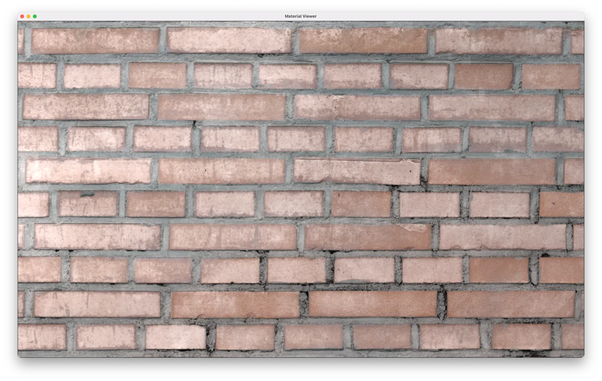
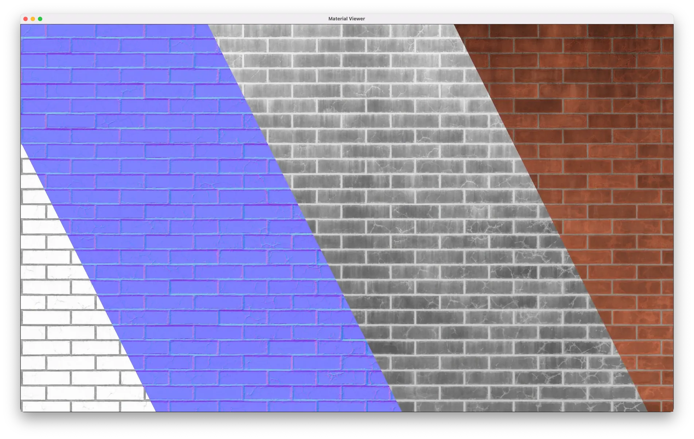

Materials Viewer
================

An upcoming Rust-based application to render, benchmark, and visualize PBR shaders and materials.

🙋 **HIRING!** 🙋 ``texture·design`` is looking for a Rust developer as 3D Graphics Programmer to work on this repository and more!  If this sounds interesting to you, contact us via the `email address <https://github.com/texturedesign>`_ on the organization page.

    ``Mockup 1``: Application window that renders a SVBRDF with physically-based rendering, based on a prototype in Python that was too slow!

1. Benchmarking Tool
--------------------

The primary goal of this tool is benchmarking: to assist in measuring performance of PBR shaders — both in computation and memory usage.  We have tools to render in Python, but these don't provide sufficient insight into the GPU performance.  This app is to be written in a high-level but performant language like Rust for this reason.

Features
~~~~~~~~
- Physically-based rendering of materials.
- Measure performance of material shaders.
- Change settings for textures (e.g. BCn compression).
- Headless mode for accuracy & automation.
- Display statistics or save to disk.

2. Demo Application
-------------------

The secondary goal of this app is to preview PBR shaders, so technical artists and generative engineers can see the results of their work quickly in a visually pleasing and interactive way.

Features
~~~~~~~~
- High-quality displacement mapping.
- Polar camera in top-down mode.
- Controls for zoom levels.
- Switch between material shaders.
- Automatic reloading of assets.

    ``Mockup 2``: Application window that shows the different properties of the material, or parameters of the SVBRDF.

Roadmap
-------

1. **Proof Of Concept** — Decide which Rust-based 3D engine to use (e.g. Bevy) and prototype the minimal application to render a PBR material. 
2. **Minimum Viable Prototype** — Estimate complexity of the features above and implement those necessary for a first iteration. 
3. **Testing & Scaling** — Running visual checks and stress tests on a dataset of materials and a variety of procedural shaders.

🙋 **HIRING!** 🙋 ``texture·design`` is looking for a Rust developer as 3D Graphics Programmer to work on this repository and more!  If this sounds interesting to you, contact us via the `email address <https://github.com/texturedesign>`_ on the organization page.
